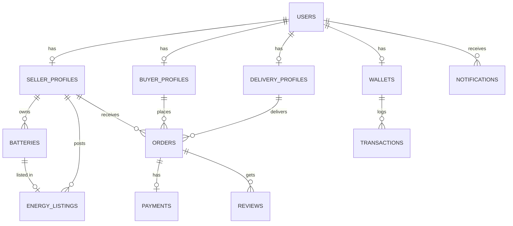

# Implementation Plan - PowerShare Renewable Energy Marketplace

PowerShare is a peer-to-peer renewable energy marketplace enabling users with rechargeable battery packs (storing solar, wind, etc.) to sell stored electricity to buyers. Buyers can purchase energy, request delivery of charged battery packs, and return or exchange empty ones.

---

## 1. System Architecture

```mermaid
graph TD
    subgraph Client Layer (Frontend)
        React[React 19 / Vite / Tailwind CSS]
        Framer[Framer Motion]
        Leaflet[Google Maps & React Icons]
    end

    subgraph Backend Layer (API Gateway & Core)
        Spring[Spring Boot 3.x / Java 21 / Spring Security]
        JWT[JWT Authentication Provider]
        WS[WebSocket Manager - Realtime Tracking & Chat]
    end

    subgraph Persistence Layer (Data Store)
        Postgres[PostgreSQL DB]
        JPA[Spring Data JPA & Hibernate]
    end
    
    subgraph External & AI Layer
        AI[Mock/Local AI Recommendation & Health Predictor]
        Cloudinary[Cloudinary for Document Uploads]
    end

    React <-->|REST APIs / JSON| Spring
    React <-->|WebSockets| WS
    Spring <-->|JPA/SQL| Postgres
    Spring <-->|External Calls| AI
    Spring <-->|Media Storage| Cloudinary
```

### High-level Core Tech Details:
- **Spring Boot Backend**: Organized as multi-tier package architecture: controller, service, repository, DTO, entity, exception, config, security.
- **Spring Security + JWT**: Stateless token-based security protecting specific role paths (`ROLE_BUYER`, `ROLE_SELLER`, `ROLE_DELIVERY`, `ROLE_ADMIN`).
- **React Frontend**: Modern, modular SPA with Vite. Clean components, tailwind-designed layouts with luxury colors (emerald green, slate dark theme, gradient cards).
- **PostgreSQL Database**: Normalized schema with constraint limits, index optimizations on queries, tracking transactions, orders, wallets.

---

## 2. Database Schema (Draft)



- **Users**: Admin, Seller, Buyer, Delivery Partner profiles.
- **Batteries**: Capacity (kWh), Voltage, Type (LiFePO4, Li-ion), Current Charge, Health rating.
- **Energy Listings**: Relates a Battery to available energy, pricing, radius, availability.
- **Orders**: Tracking state (`PENDING`, `ACCEPTED`, `DISPATCHED`, `COMPLETED`, `RETURN_PENDING`, `RETURNED`).
- **Realtime / Tracking**: WebSocket locations.

---

## 3. Phased Implementation Roadmap

To develop this project systematically, we will follow the module-by-module building instructions, prompting for approval at the end of each module:

```
┌─────────────────────────────────────────────────────────────┐
│ PHASE 1: Project Skeleton & Configuration [COMPLETED]       │
│ Set up workspace, Spring Boot structure, React Vite app.   │
└──────────────┬──────────────────────────────────────────────┘
               ▼
┌─────────────────────────────────────────────────────────────┐
│ PHASE 2: Auth, Wallet, and Profiles [COMPLETED]             │
│ User registration, login, role configurations & Wallets.    │
└──────────────┬──────────────────────────────────────────────┘
               ▼
┌─────────────────────────────────────────────────────────────┐
│ PHASE 3: Battery & Listing Management [COMPLETED]            │
│ Seller adds, edits, deletes batteries; list energy items.   │
└──────────────┬──────────────────────────────────────────────┘
               ▼
┌─────────────────────────────────────────────────────────────┐
│ PHASE 4: Buyer Search, Orders, Checkout & Payments [COMPLETED] │
│ Search filters, cart/checkout simulation, wallet debit.     │
└──────────────┬──────────────────────────────────────────────┘
               ▼
┌─────────────────────────────────────────────────────────────┐
│ PHASE 5: Delivery Dispatch, Socket Flow, Returns [COMPLETED]│
│ Order acceptance, delivery matching, active tracking.       │
└──────────────┬──────────────────────────────────────────────┘
               ▼
┌─────────────────────────────────────────────────────────────┐
│ PHASE 6: Admin Panel Dashboard [COMPLETED]                  │
│ Overall platform control, verification queues, analytics.   │
└─────────────────────────────────────────────────────────────┘
```

### Build & Delivery Protocol per Module:
1. Explain module architecture and database additions.
2. Generate backend files (configs, controllers, services, entities, DTOs).
3. Generate frontend code (UI components, API interfaces, routers, Tailwind classes).
4. Explain code & APIs written.
5. Wait for approval.

---

## 4. Let's Get Started

Are you ready to proceed with **Phase 1: Project Skeleton Setup** (initializing the directories, Gradle/Maven build config, Spring Boot properties, React-Vite UI base)? 
We will verify and construct files in the next step. Let us know if any adjustments are needed first!
